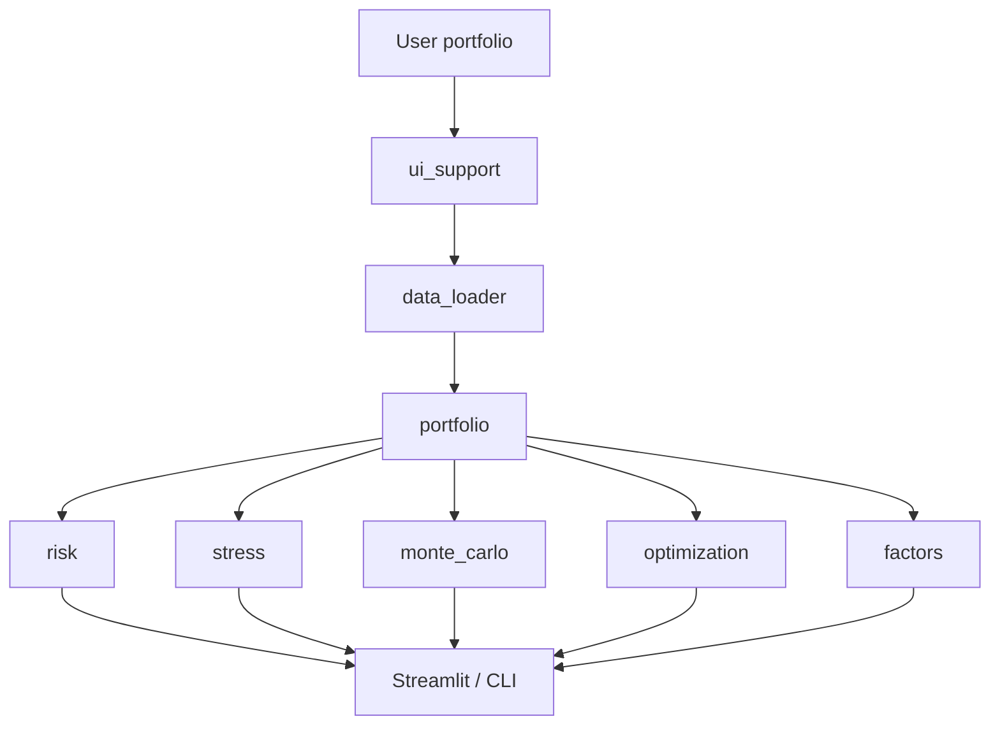

# Portfolio Risk & Analytics Platform

An interactive portfolio risk and decision-support platform built in Python.

Enter a book of stocks or ETFs and run performance, risk, stress testing, Monte Carlo, optimization and factor analysis through one product-style interface. The same quantitative engines power a Streamlit dashboard and a CLI. This is a research and recruiting project, not a production risk system.

It is built as a **reusable application** for user-defined portfolios, not a notebook that only analyzes one hard-coded book.

Screenshots of the dashboard belong in [`docs/screenshots/`](docs/screenshots/README.md) (Overview, Risk, Stress, Monte Carlo, Optimization, Factors). Capture them from the default demo after the pages are populated.

**Default demo (loads on first Analyze):** SPY 30% · QQQ 15% · IWM 10% · EFA 10% · TLT 15% · LQD 10% · GLD 10% · $1,000,000 · sample from 2015-01-01.

---

## Key features

**Input.** Manual table, CSV, or one-click demo. Weights or dollar positions. Invalid tickers are isolated instead of crashing the book.

**Performance.** Growth of $1, drawdown timeline, rolling return/vol/Sharpe, correlations, return contribution.

**Risk.** Historical and Gaussian VaR/CVaR, Euler risk contribution, diversification ratio, capital-vs-risk dumbbell.

**Stress.** Eight library scenarios, mapping for unknown names, custom shocks, historical worst windows, reverse stress. Unmapped names are never silently shocked by 0%.

**Monte Carlo.** Gaussian, historical bootstrap, block bootstrap. Fan chart of percentile bands; sample paths are secondary.

**Optimization.** Minimum volatility, maximum Sharpe, constrained efficient frontier, expected-return sensitivity, covariance-model comparison.

**Factors.** Academic Fama–French + momentum and tradeable proxy ETFs as **separate** models. Systematic vs idiosyncratic split, covariance shrinkage.

---

## Interactive dashboard

```bash
streamlit run streamlit_app.py
```

Eight pages: Overview, Performance, Risk, Stress Tests, Monte Carlo, Optimization, Factors, Data & Methodology.

After you capture images, drop them in `docs/screenshots/` using the checklist in that folder. Until then, run the app locally — empty-state screenshots should not go in this README.

---

## Architecture

Financial math lives in `src/`. The UI does not reimplement it.



Details: [`docs/architecture.md`](docs/architecture.md).

---

## Example analysis

Sample output for the **default 7-ETF demo**, using adjusted Yahoo Finance data from **2015-01-05 through 2026-08-14** (2,918 daily returns). Figures move when the vendor revises history or the end date changes. They are not a forecast.

| Metric | Sample value |
|---|---|
| Annualized return | 10.83% |
| Annualized volatility | 12.47% |
| Sharpe ratio (2% RF) | 0.73 |
| Maximum drawdown | −25.59% |
| 1-day historical VaR 95% | 1.16% |
| 1-day historical CVaR 99% | 3.15% |
| Diversification ratio | 1.38 |
| Largest risk contributor | SPY (~39.8% of vol from 30% of capital) |

---

## Quantitative methods

| Topic | One-line definition |
|---|---|
| Daily return | `P_t / P_{t-1} - 1` on split/dividend-adjusted closes |
| Portfolio | Constant mix: `Σ w_i r_i,t` (daily rebalance to target weights) |
| Annualized return | Geometric / CAGR, 252-day year |
| Volatility | Sample stdev × √252 |
| Sharpe | Daily excess vs a geometrically de-annualized constant RF |
| Historical VaR / CVaR | Empirical quantile / tail mean, **positive loss magnitudes** |
| Gaussian VaR / CVaR | Normal tail from sample moments |
| Multi-day historical VaR | Overlapping compounded windows, not √t scaling |
| Risk contribution | Euler decomposition of portfolio volatility |
| Stress P&L | `Σ w_i s_i` on pre-shock weights |
| Monte Carlo | Correlated Gaussian, day bootstrap, or block bootstrap |
| Optimization | SLSQP, long-only default, independently verified constraints |
| Academic factors | Ken French daily FF3 + momentum (percent → decimal) |
| Proxy factors | Tradeable ETF spreads; not the same model |

Missing prices are never filled. Full write-up: [`docs/methodology.md`](docs/methodology.md).

### Stress mapping for unknown names

1. Library shock if the ticker is in the scenario  
2. Factor-implied `s = Bf` if an academic factor model has been fit  
3. Market beta × SPY shock  
4. **Unmapped** — labelled; zero only if you explicitly opt in  

---

## Testing and validation

```bash
python -m pytest
```

Offline unit tests cover the engines plus input parsing, scenario mapping and visual helpers. Streamlit widgets are not screenshot-tested. **545 tests passing.**

Core identities checked in tests (and in `tests/test_invariants.py`):

- weights sum to 1  
- return contributions sum to cumulative portfolio return  
- component vols sum to portfolio vol; risk contribution % sums to 100%  
- asset stress P&L sums to portfolio P&L  
- simulated ending return = ending value / start − 1  
- optimized weights respect budget and bounds  
- portfolio beta = weighted asset betas  
- systematic + residual = total factor-implied variance  
- shrinkage λ = 0 and λ = 1 recover the target and the sample  

---

## Tech stack

Python 3.10+ · pandas · numpy · scipy · yfinance · Streamlit · Plotly · openpyxl · pytest

---

## Installation

```bash
cd portfolio-risk-platform
python -m venv .venv
```

Windows: `.\.venv\Scripts\Activate.ps1`  
macOS / Linux: `source .venv/bin/activate`

```bash
python -m pip install -r requirements.txt
python -m pytest
streamlit run streamlit_app.py
```

No API keys. `data/` and `outputs/` are created as needed. Cloud notes: [`docs/deployment.md`](docs/deployment.md).

---

## Usage

| Command | What it does |
|---|---|
| `streamlit run streamlit_app.py` | Interactive dashboard |
| `python app.py` | Terminal report for the default demo |
| `python app.py --refresh` | Ignore the on-disk price cache |
| `python app.py --no-save` | Do not write `outputs/*.csv` |

Interview talking points and a 2–3 minute demo script: [`docs/interview_guide.md`](docs/interview_guide.md).

---

## Methodology and assumptions

- Constant-mix (daily rebalanced) portfolio, not buy-and-hold drift.  
- 252 trading days / year; default RF 2% annualized.  
- Weights that do not sum to 100% are **not** silently rescaled.  
- Ken French factors typically **lag** live prices; sample end dates are shown on purpose.  
- Mean-variance results are only as good as the expected-return vector.

---

## Limitations

- Historical VaR cannot exceed the worst observation in the window.  
- Gaussian tails understate equity crash risk.  
- Deterministic scenarios are assumptions, not probabilities.  
- Linear factor stress ignores residual risk, convexity and liquidity.  
- Max-Sharpe weights are unstable in expected returns.  
- No transaction costs, taxes, slippage or funding constraints.  
- Yahoo adjusted closes can be revised by the vendor.

---

## Project structure

```
portfolio-risk-platform/
├── streamlit_app.py          # Interactive product
├── app.py                    # Terminal report
├── config.py                 # Defaults and conventions
├── requirements.txt
├── src/                      # Quantitative engines
├── ui/                       # Charts and CSS helpers
├── tests/
├── docs/                     # Architecture, methodology, interview, screenshots
├── data/                     # Price/factor cache (gitignored)
└── outputs/                  # CLI CSVs (gitignored)
```

---

Built as a portfolio project for investment, fintech and asset-management interview conversations. Numbers describe the sample you loaded. They are not investment advice.
