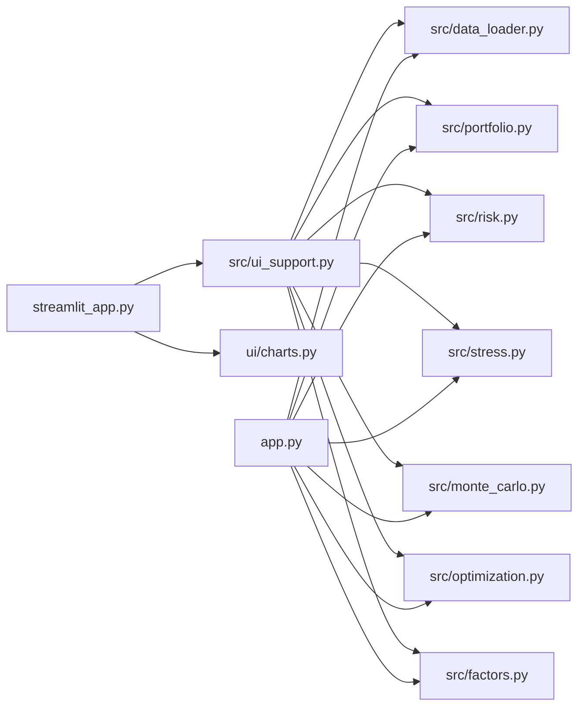

# Portfolio Risk & Analytics Platform

An interactive portfolio risk and decision-support platform built in Python.

The application lets you enter essentially any supported book of publicly traded
stocks and ETFs, download a common-calendar price history, and run performance,
risk, stress, Monte Carlo, optimization and factor analytics through one
product-style interface. The quantitative engines are covered by a large
deterministic test suite. This is a research and recruiting project, not a
production risk system.


> **Screenshot placeholder.** After running the app, capture the Overview page
> (default 7-ETF demo) and save it as `docs/screenshots/overview.png`. Additional
> captures belong in the same folder; see `docs/screenshots/README.md`.

**Default demo (loads immediately):** SPY 30% · QQQ 15% · IWM 10% · EFA 10% ·
TLT 15% · LQD 10% · GLD 10% · $1,000,000 notional · sample from 2015-01-01.

---

## Key features

- Arbitrary ticker input (manual table or CSV), weights or dollar holdings
- Live Yahoo Finance download with common-calendar alignment and no price filling
- Performance: growth, drawdown, rolling return/vol/Sharpe, correlation, return contribution
- Risk: historical and Gaussian VaR/CVaR, Euler risk contribution, diversification ratio
- Stress: scenario library adapted to unknown tickers, custom shocks, historical worst windows, reverse stress
- Monte Carlo: Gaussian, historical bootstrap, moving-block bootstrap
- Optimization: min-vol, max-Sharpe, constrained frontier, sensitivity, covariance-model comparison
- Factors: academic Fama–French + momentum **and** tradeable proxy factors, shown as separate models
- Downloadable CSV / Excel of summary tables (not raw simulation cubes)

---

## Run the application

```bash
cd portfolio-risk-platform
python -m pip install -r requirements.txt
streamlit run streamlit_app.py
```

The terminal report is unchanged:

```bash
python app.py
```

A recruiter opening the Streamlit app should see a complete Overview analysis of
the default ETF portfolio without configuring anything.

---

## Architecture

The Streamlit UI does **not** reimplement financial math. It calls `src/`.



```
portfolio-risk-platform/
├── streamlit_app.py          # Interactive product layer
├── app.py                    # Terminal report (preserved)
├── config.py                 # Defaults, conventions, demo weights
├── ui/charts.py              # Plotly figures
├── src/
│   ├── data_loader.py
│   ├── portfolio.py
│   ├── risk.py
│   ├── stress.py
│   ├── monte_carlo.py
│   ├── optimization.py
│   ├── factors.py
│   └── ui_support.py         # Input parsing, scenario mapping, formatting
├── tests/
└── docs/screenshots/
```

---

## Portfolio input

Three methods, all flowing through the same validation:

1. **Default demo** — one-click 7-ETF book
2. **Manual entry** — editable ticker / weight% or dollar-position table
3. **CSV upload** — `Ticker,Weight` or `Ticker,MarketValue` (column aliases accepted)

Dollar positions become weights as `position_i / portfolio value`. If you do not
override the notional, the value is the sum of positions. Weights that do not
sum to 100% are **not** silently rescaled; enable “Normalize weights to 100%”.

Invalid tickers are isolated rather than crashing the app. A recently listed
name that shortens the common history is called out explicitly.

---

## Example portfolios

| Book | What it demonstrates |
|---|---|
| Default 7 ETFs | Multi-asset demo used by the CLI |
| AAPL / MSFT / NVDA / AMZN / JPM | All-equity stock book; scenarios mapped via beta / factors |
| Two-asset book | Constraint feasibility (a 40% cap is raised so the budget can be filled) |
| Book including a recent IPO | Common-history truncation warning |
| Book including `NOTAREAL` | Graceful download error |

---

## Methodology (short)

| Metric | Definition |
| --- | --- |
| Daily return | `P_t / P_{t-1} - 1` on split/dividend-adjusted closes |
| Portfolio return | `Σ w_i r_i,t` (constant mix ⇒ daily rebalancing) |
| Annualized return | Geometric / CAGR, 252-day year |
| Annualized volatility | Sample stdev × √252 |
| Sharpe | Daily excess returns vs a geometrically de-annualized constant risk-free rate |
| Historical VaR / CVaR | Empirical quantile / tail mean, reported as **positive loss magnitudes** |
| Gaussian VaR / CVaR | Normal tail using sample moments |
| Multi-day historical VaR | Overlapping compounded windows, not √t scaling |
| Risk contribution | Euler decomposition of portfolio volatility |
| Stress P&L | `Σ w_i s_i` on pre-shock weights |
| Monte Carlo | Correlated Gaussian, day bootstrap, or block bootstrap; horizon-level VaR |
| Optimization | SLSQP, long-only default, independently verified constraints |
| Academic factors | Ken French daily FF3 + momentum, percents → decimals |
| Proxy factors | Tradeable ETF spreads; **not** the same model |

Missing prices are never filled. The panel starts at the latest common inception
and drops any date on which at least one asset is missing.

### Stress mapping for arbitrary securities

Predefined scenarios are written on SPY / QQQ / IWM / EFA / TLT / LQD / GLD.
For any other ticker the UI applies this hierarchy and **does not assume a zero
shock**:

1. Library shock if the ticker is named in the scenario
2. Factor-implied shock `s = B f` when an academic factor model has been fitted
3. Market beta × SPY (or the next available equity proxy) shock
4. **Unmapped** — labelled, and either a manual shock or an explicit “treat as 0%” opt-in is required

---

## Testing

```bash
python -m pytest
```

The quantitative engines are covered by deterministic, offline unit tests.
Presentation helpers (CSV parsing, weight normalization, scenario mapping,
formatting, downloads) have their own tests. Streamlit rendering is not
exhaustively unit-tested.

| Layer | Tests |
| --- | --- |
| Phases 1–6 quantitative engines | 497 |
| Phase 7 UI helpers | 37 |
| **Total** | **534 passing** |

---

## Technology stack

Python 3.10+ · pandas · numpy · scipy · yfinance · streamlit · plotly · openpyxl · pytest

---

## Limitations

This is not institutional production software. In particular:

- Historical VaR cannot exceed the worst observation in the window.
- Gaussian tails understate equity crash risk.
- Deterministic scenarios are assumptions, not probabilities.
- Linear factor stress ignores residual risk, convexity and liquidity.
- Mean-variance weights are unstable in expected returns; the sensitivity table exists because of that.
- Ken French data lags live prices; factor sample end dates are shown on purpose.
- No transaction costs, taxes, slippage, or funding constraints.
- Yahoo Finance adjusted closes can be revised by the vendor.

Read the engine modules for the full methodology notes. The Data & Methodology
page in the app surfaces the same caveats next to the live sample dates.

---

## License / use

Built as a portfolio project for investment, fintech and asset-management
interview conversations. Numbers describe the sample you loaded. They are not
investment advice.
