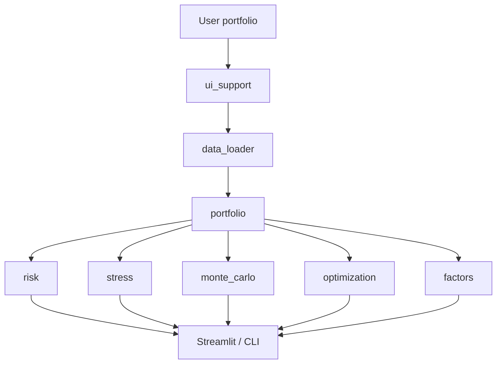
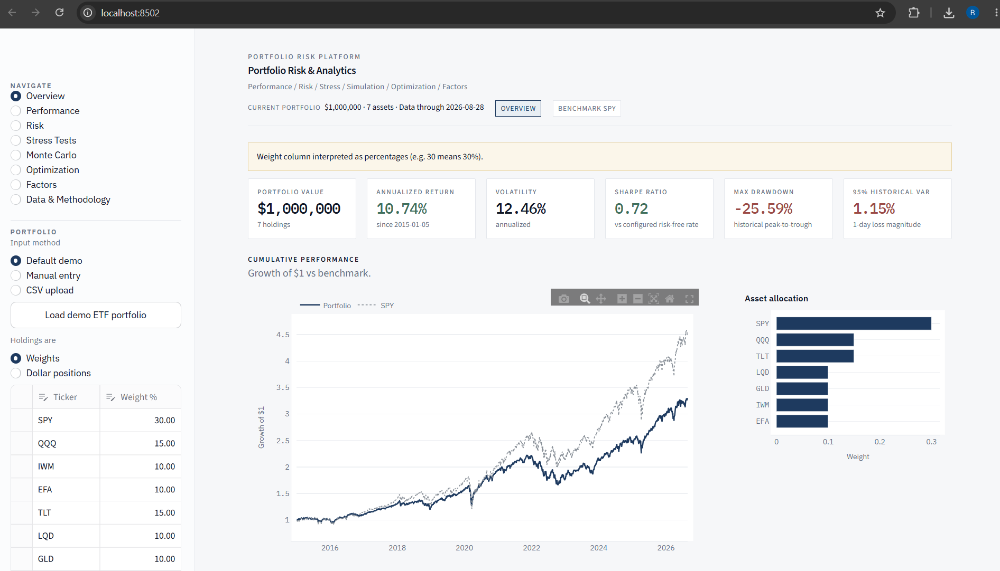
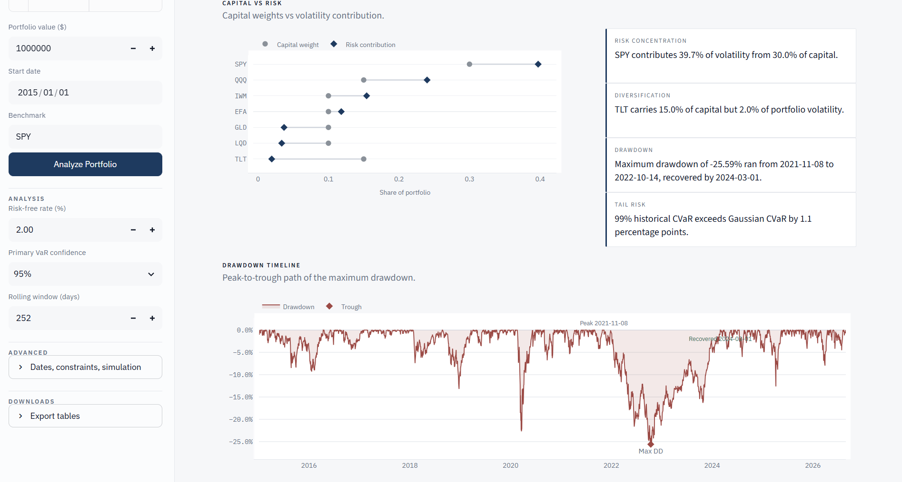
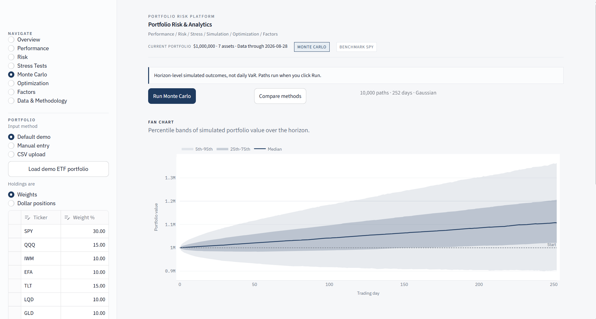
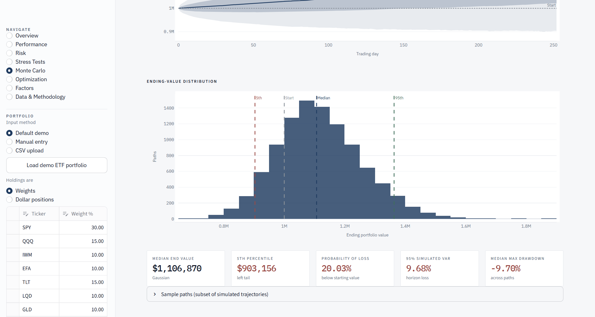
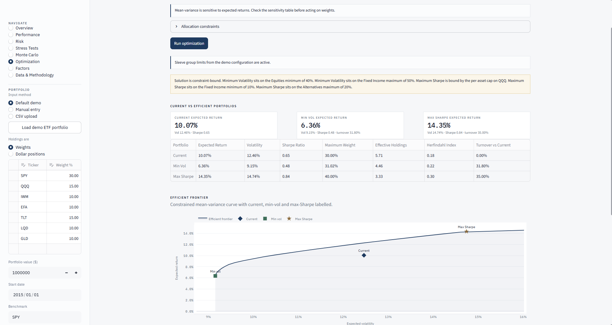
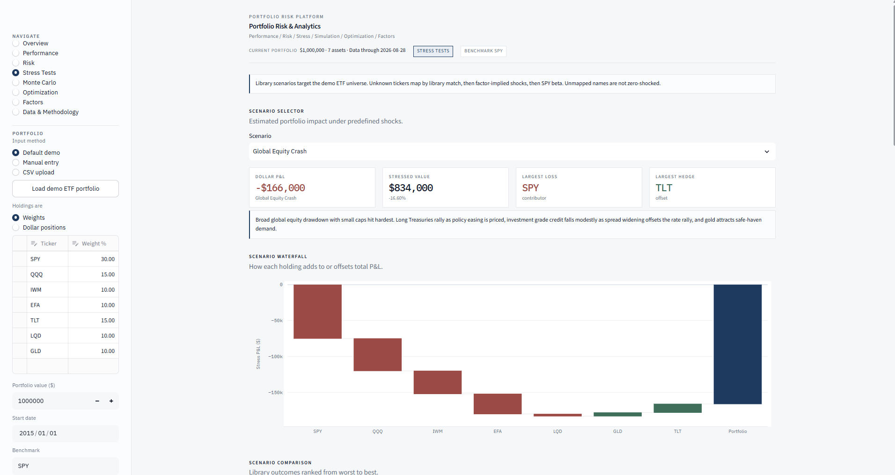

# Portfolio Risk & Analytics Platform

Python app for analyzing a stock or ETF portfolio from a few different angles: performance, risk, stress tests, Monte Carlo, optimization, and factor exposure.

You can use the default multi-asset demo, type in your own holdings, or upload a CSV. The Streamlit dashboard and the CLI both call the same calculation code in `src/`.

This is a personal / learning project, not a production risk system.

**Default demo:** SPY 30%, QQQ 15%, IWM 10%, EFA 10%, TLT 15%, LQD 10%, GLD 10%, $1,000,000, starting 2015-01-01.

## Features

- Input: demo portfolio, manual table, or CSV (weights or dollar amounts)
- Performance: growth, drawdown, rolling stats, correlation, return contribution
- Risk: historical and Gaussian VaR/CVaR, risk contribution, diversification
- Stress: scenario library, custom shocks, historical worst windows, reverse stress
- Monte Carlo: Gaussian, historical bootstrap, block bootstrap
- Optimization: minimum volatility, maximum Sharpe, constrained frontier
- Factors: Fama-French + momentum, plus a separate ETF proxy model

Unknown tickers in stress tests are mapped explicitly (or left unmapped). They are not silently shocked by 0%.

## Running the project

```bash
cd portfolio-risk-platform
python -m venv .venv
```

Activate the virtual environment, then:

```bash
python -m pip install -r requirements.txt
python -m pytest
streamlit run streamlit_app.py
```

```bash
python app.py            # terminal report for the default demo
python app.py --refresh  # ignore the price cache
python app.py --no-save  # do not write CSV files under outputs/
```

Needs Python 3.10+. No API keys. The `data/` and `outputs/` folders are created when needed.

More deploy notes: [docs/deployment.md](docs/deployment.md).

## Example

Sample numbers for the default 7-ETF book using Yahoo Finance adjusted closes from about 2015-01-05 through 2026-08-28. These change when the sample changes. They are not a forecast.

| Metric | Value |
|---|---|
| Annualized return | 10.74% |
| Annualized volatility | 12.46% |
| Sharpe (2% risk-free) | 0.72 |
| Max drawdown | -25.59% |
| 1-day historical VaR 95% | 1.15% |
| Diversification ratio | 1.38 |
| Largest risk contributor | SPY (39.7% of vol from 30.0% of capital) |

## How it works

Market data is downloaded and aligned, then portfolio returns are built from the weights. Risk, stress, simulation, optimization, and factor code sit on top of that. The UI does not redo the math.



See [docs/architecture.md](docs/architecture.md).

## Methods

| Topic | What the code does |
|---|---|
| Returns | Adjusted close `P_t / P_{t-1} - 1`; constant-mix portfolio |
| CAGR / vol | Geometric annualization; sample stdev x sqrt(252) |
| VaR / CVaR | Positive loss magnitudes; multi-day historical uses overlapping compounds |
| Risk contribution | Euler split of portfolio volatility |
| Stress | Weighted sum of asset shocks |
| Monte Carlo | Correlated Gaussian or bootstrap paths |
| Optimization | SLSQP with constraint checks |
| Factors | Ken French FF3+MOM (percent to decimal); proxies are separate |

More detail: [docs/methodology.md](docs/methodology.md).

## Testing

```bash
python -m pytest
```

There are 548 offline tests covering the engines, input parsing, and scenario mapping. They check things like weight sums, risk contribution totals, stress P&L identity, and optimization bounds.

## Tech stack

Python, pandas, numpy, scipy, yfinance, Streamlit, Plotly, openpyxl, pytest

## Limitations

- Historical VaR cannot be worse than the worst day in the sample
- Gaussian VaR understates fat left tails
- Stress scenarios are assumptions, not probabilities
- Max-Sharpe weights move a lot when expected returns change
- No trading costs, taxes, or liquidity
- Yahoo prices can be revised; Ken French factors usually lag live prices

## Project structure

```
portfolio-risk-platform/
├── streamlit_app.py
├── app.py
├── config.py
├── requirements.txt
├── src/
├── ui/
├── tests/
├── docs/
├── data/       # cache (gitignored)
└── outputs/    # CLI exports (gitignored)
```
## Dashboard Preview

### Portfolio Overview

The overview summarizes portfolio performance, allocation, volatility, Sharpe ratio, maximum drawdown, and historical VaR while benchmarking cumulative performance against SPY.



### Risk & Drawdown Analysis

Risk analytics compare capital weights with volatility contribution and highlight concentration, diversification, tail risk, and the portfolio's historical drawdown path.



### Monte Carlo Simulation

Monte Carlo analysis simulates 10,000 portfolio paths across a 252-trading-day horizon and displays percentile bands around simulated portfolio value.



The ending-value distribution summarizes terminal outcomes including median value, downside percentile, probability of loss, simulated VaR, and maximum drawdown.



### Portfolio Optimization

Constrained mean-variance optimization compares the current portfolio with minimum-volatility and maximum-Sharpe portfolios across the efficient frontier.



### Stress Testing

Scenario analysis estimates portfolio-level and position-level P&L under predefined market shocks and identifies the largest loss contributors and potential hedges.




Not investment advice. Numbers only describe the sample you load.
