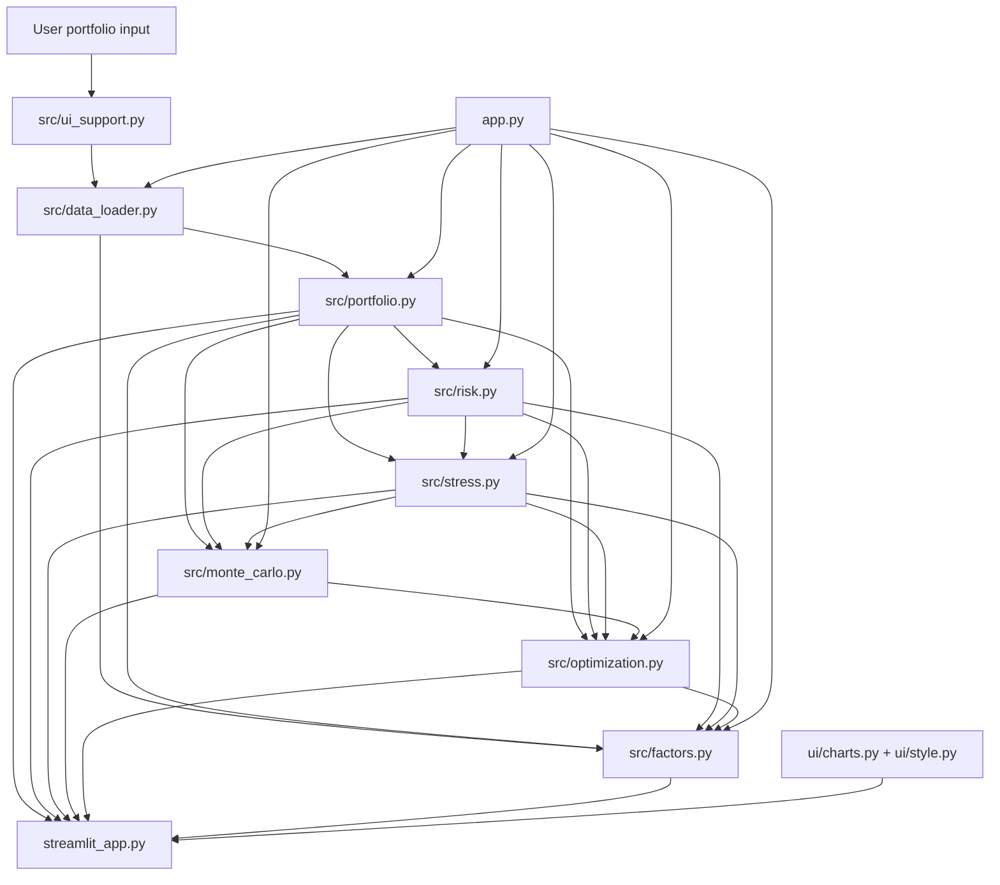

# Architecture

The platform is a **library of quantitative engines** with two thin presentation layers. Financial math lives in `src/`. The Streamlit app and the CLI call those functions; they do not reimplement them.

## How the pieces actually connect

Market data and the portfolio engine are always used. Risk and stress sit on top of portfolio returns. Monte Carlo and optimization reuse those layers. The factor engine can call optimization and stress, but it is optional: if Ken French data is unavailable, performance, risk, stress, simulation and optimization still run.

## Layer responsibilities

| Layer | Role |
|---|---|
| `config.py` | Defaults, conventions, demo weights. No calculations. |
| `src/data_loader.py` | Yahoo Finance download, common-calendar alignment, no price filling, on-disk cache under `data/`. |
| `src/portfolio.py` | Weights, constant-mix returns, CAGR, volatility, Sharpe, drawdown, contribution, covariance. |
| `src/risk.py` | Historical and Gaussian VaR/CVaR, Euler risk contribution, diversification, rolling risk. |
| `src/stress.py` | Scenario library, P&L attribution, historical worst windows, reverse stress, correlation stress. |
| `src/monte_carlo.py` | Gaussian, historical bootstrap, and block-bootstrap paths; horizon-level risk. |
| `src/optimization.py` | Min-vol, max-Sharpe, constrained frontier, sensitivity; independent constraint checks. |
| `src/factors.py` | Academic FF3+momentum and proxy ETF factors, risk decomposition, covariance shrinkage. |
| `src/ui_support.py` | Parsing, scenario mapping for unknown tickers, formatting. No new formulas. |
| `ui/charts.py`, `ui/style.py` | Plotly theme and HTML/CSS helpers. |
| `streamlit_app.py` | Interactive product. |
| `app.py` | Terminal report using the same engines. |

## Design rules that matter in an interview

1. **One source of truth.** A VaR figure on the dashboard is the same function the CLI and the tests call.
2. **Missing data is never filled.** A filled price would fabricate a 0% return and then a jump.
3. **Unknown tickers are not silently shocked by 0%.** Stress mapping is library match → factor-implied `Bf` → market beta to SPY → labelled unmapped.
4. **Heavy jobs are explicit.** Monte Carlo, optimization and factor fits run only when the user clicks Run. Overview/Performance/Risk use cheaper analytics.
5. **Optional sources fail locally.** A missing benchmark or factor file does not take down the rest of the app.

## Caching

- Price panels: CSV under `data/prices_*.csv`, refreshed after `CACHE_MAX_AGE_DAYS` (1 day).
- Ken French factors: CSV under `data/factors_*.csv`, refreshed after `FACTOR_CACHE_MAX_AGE_DAYS` (7 days).
- Streamlit: `@st.cache_data` on downloads, keyed by tickers, dates and refresh flag. Changing the portfolio fingerprint clears Monte Carlo, optimization and factor session state so stale results are not shown for a new book.
