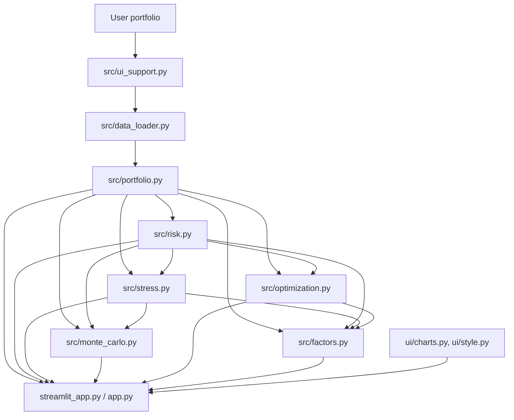

# Architecture

Calculation code lives in `src/`. Streamlit and the CLI call those modules; they do not reimplement the math.

| Module | Role |
|---|---|
| `config.py` | Defaults |
| `data_loader.py` | Yahoo download, calendar alignment, cache |
| `portfolio.py` | Weights, returns, CAGR, vol, Sharpe, drawdown, covariance |
| `risk.py` | VaR/CVaR, risk contribution, diversification |
| `stress.py` | Scenarios, P&L, historical windows, reverse stress |
| `monte_carlo.py` | Gaussian and bootstrap paths |
| `optimization.py` | Min-vol, max-Sharpe, frontier |
| `factors.py` | Factor regressions, proxy factors, shrinkage |
| `ui_support.py` | Parsing, scenario mapping, formatting |

Monte Carlo, optimization, and factor fits run when you ask for them. If Ken French data is unavailable, the other pages still work.

Price cache: `data/prices_*.csv` (about 1 day). Factor cache: `data/factors_*.csv` (about 7 days).
